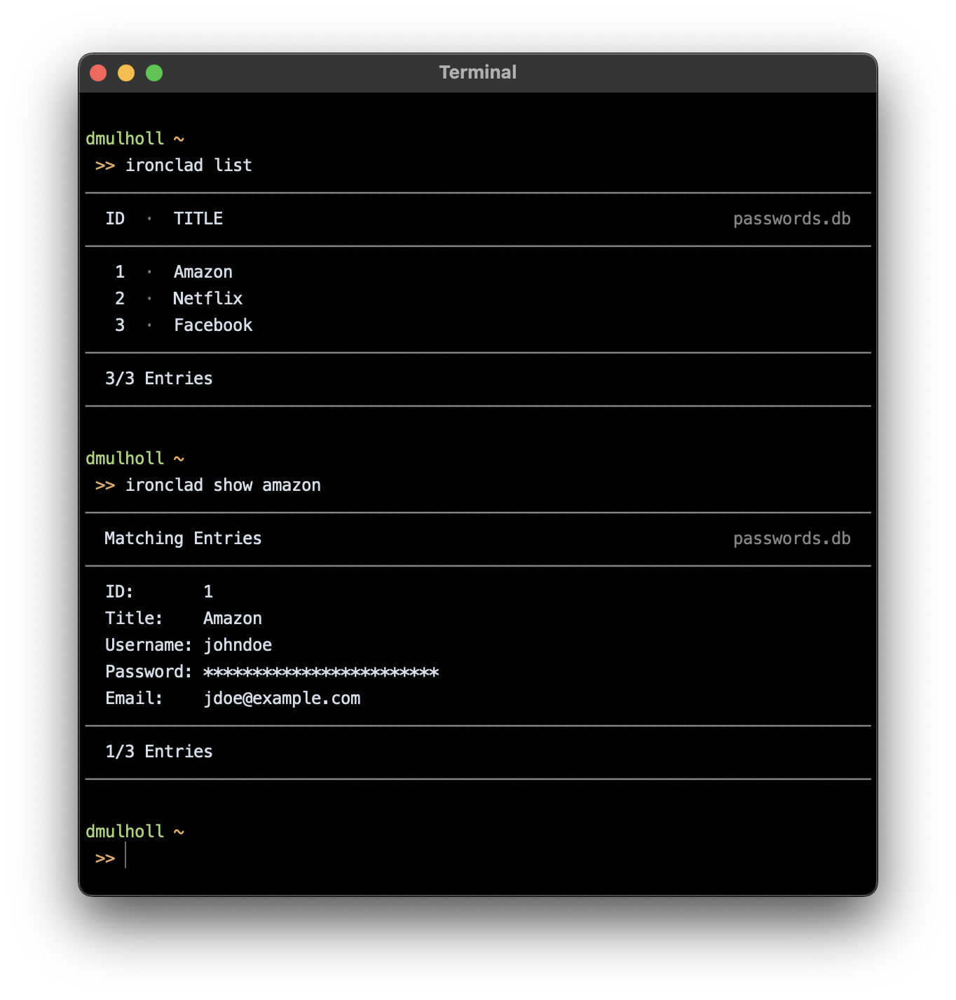

# Ironclad

[1]: http://www.dmulholl.com/docs/ironclad/master/
[2]: https://github.com/dmulholl/ironclad/releases

Ironclad is a command line utility for creating and managing encrypted password databases.
See the [documentation][1] for details.

    

Ironclad is written in Go. If you have a Go compiler installed you can install Ironclad by running:

    go install github.com/dmulholl/ironclad/ironclad@latest

This will download, compile, and install the latest version of the application to your `$GOPATH/bin` directory.
Alternatively, you can download a [pre-compiled binary][2].
